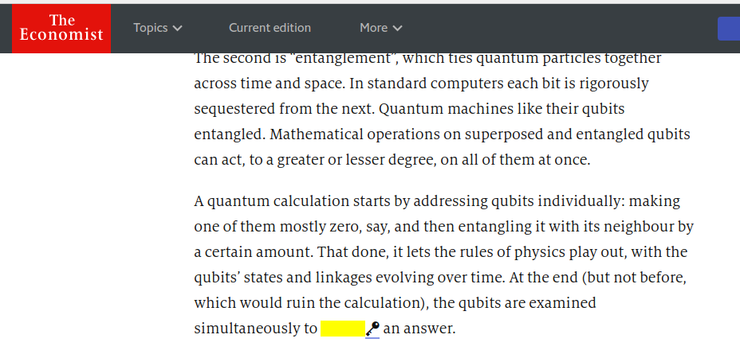
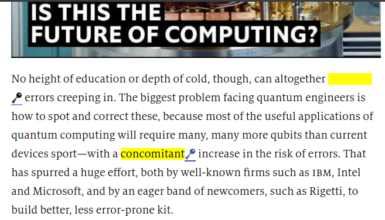
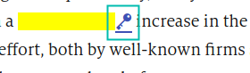

# gre-cloze
Guess GRE vocabulary as you browse news on [economist.com](https://www.economist.com), [newyorker.com](http://newyorker.com), [theatlantic.com](https://theatlantic.com) and [Scientific American](https://www.scientificamerican.com/) too.  
<p align="center">

</p>

This extension is a modification of [VocabularyHighlighter](https://github.com/jn8029/VocabularyHighlighter) by [jn8029](https://github.com/jn8029).


## Installation
1. Clone the repository using the command:

```shell
$ git clone https://github.com/amitness/gre-cloze
```

2. Then, goto `Extensions` page on Google Chrome, and click `Load Unpacked`.

3. Set the path to the cloned folder

## Usage
1. Browse any article on economist.com. All words in the article that are present in the Magoosh Vocabulary list will be highlighted and replaced with a blank.

<p align="center">
  
</p>

2. Guess the word based on the surrounding context. To check if you were right, hover over the yellow blank. The actual word will be revealed.  
<p align="center">
  
</p>


3. To check the definition of the word, you can click on the key icon. This will open the word definition on vocabulary.com in a new tab.  
<p align="center">
  
  
</p>
